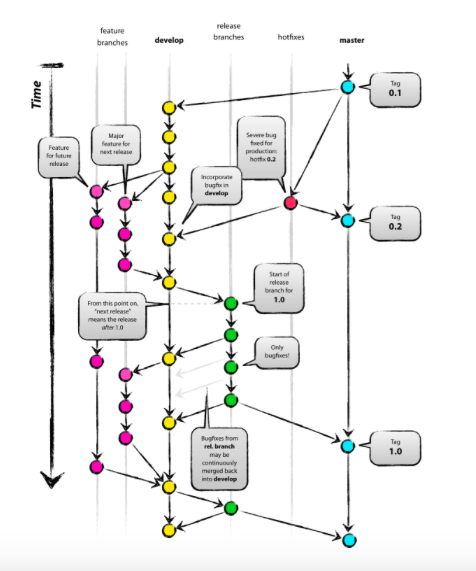

# 复习目录

## 数据结构

## 网络工程

## 移动客户端内容
### 基础知识

#### UI知识

- px（photoshop等单位）重要换算单位。dpi（输出设备，打印设备）：每英寸所能打印的点数，打印分辨率；ppi：图像分辨率，每英寸所包含的像素数目。

### 架构
APP做什么：

1. 调用网络API 
2. 展现列表
3. 选择列表
4. 展现单页

架构就要考虑：

* 调用网络API
* 页面展示
* 数据的本地持久化
* 动态部署方案

通俗来说

- 如何让业务开发工程师方便安全地调用网络API？然后尽可能保证用户在各种网络环境下都能有良好的体验？
- 页面如何组织，才能尽可能降低业务方代码的耦合度？尽可能降低业务方开发界面的复杂度，提高他们的效率？
- 当数据有在本地存取的需求的时候，如何能够保证数据在本地的合理安排？如何尽可能地减小性能消耗？
- iOS应用有审核周期，如何能够通过不发版本的方式展示新的内容给用户？如何修复紧急bug？

针对团队

- 收集用户数据，给产品和运营提供参考
- 合理地组织各业务方开发的业务模块，以及相关基础模块
- 每日app的自动打包，提供给QA工程师的测试工具

### Java Web
### JavaScript
#### http://underscorejs.org/#reject

### Android

### iOS
#### iOS开发须知
##### 通知与消息体制

- 本地通知
- 推送通知
 
#### Swift2.0
##### Swift的?和!

#### Objective-C
#### MVVM

## 知道创宇
### WEB应用漏洞
#### OWASP

## 实践其他

### 团队开发

#### 版本管理
##### git
- commit记下，定下一些版本
- discard changes放弃变化
- 发布使用的必须是master分支（branch）
- 开发新功能的时候可以使用一个新的Branch
- 经过测试之后在合成分支merger branch到master版本
- .git记录了那些文件是需要被管理的

#### gitblit

#### .gitignore
适应不同类型项目的时候可以忽略一些不需要使用的文件，只需要将所需的源代码commit或push即可

#### git的一些命令

- git init
- git add 
- git remote 
- git pull push
- git commit

#### github

[多人协同开发中](http://livoras.com/post/28)

- origin，项目发起人建立的源仓库
- origin，存放稳定，发布的版本

并行开发时：

- 开发者从origin中fork自己的仓库，并提交commit到自己的仓库
- 当自己开发的代码趋于成熟，再pull request到origin中
- 交由项目发起人进行合并，管理

